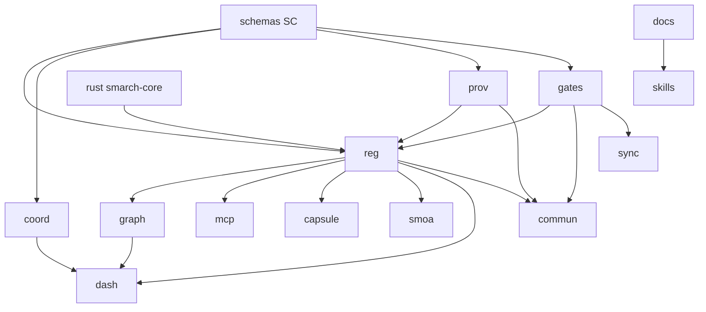

# 03 — Target Architecture

## Target module map (17 modules)

| Module | Responsibility | Key pillar(s) | Lane default | allowed_deps |
|---|---|---|---|---|
| coord (CO) | Leases, agent-context, conflicts, controller, **ambient hooks** | V-02, V-14 | single-module | schemas |
| prov (PR) | Attestations, seals, merkle, license lattice, similarity | V-03, V-16 (lattice ext.) | single-module | schemas |
| reg (RG) | Scanner, registry, store/clone/release, portfolio | V-01 | single-module | schemas, prov, gates, rust |
| gates (GA) | Rule/scope/security/license/compliance/size gates, validate, CI pipeline tool | V-01 | single-module | schemas |
| graph (GR) | Graphify bridge: **embeddings, staleness, global query, summaries** | V-04 | single-module | schemas, reg |
| mcp (MC) | **MCP server** over registry/store + Server Card | V-05 | single-module | schemas, reg, prov |
| capsule (CP) | **Constraint-first brick tier**: scaffold + run/inspect CLI | V-06 | single-module | schemas, reg, gates |
| smoa (SM) | Codex integration + **workforce-backend abstraction** | V-09 | single-module | schemas, reg |
| dash (DA) | Wiki generators + **self-hostable web dashboard** | V-18 | single-module | schemas, reg, coord, graph |
| skills (SK) | The 6+ skills, install tooling, **plugin packaging** | V-12 | single-module | docs |
| schemas (SC) | JSON Schemas + **generated types** (single source of truth) | V-08 | **shared-hot-path** | — |
| docs (DO) | Framework docs, README, **INFLUENCES.md**, demo assets | V-07, V-13 | single-module | — |
| ci (CI) | **GitHub Actions**, gitleaks, pre-commit, tsconfig | V-10 | **shared-hot-path** | — |
| evals (EV) | **Agent-performance eval harness** | V-11 | single-module | schemas, coord, smoa |
| commun (CM) | **Community submissions, showcase; monetization docs/tooling** | V-16, V-17 | single-module | schemas, reg, prov, gates |
| rust (RS) | **smarch-core kernel** (scan walk/hash/similarity), static binary | V-08 | single-module | — |
| sync (SY) | **Dual-repo sync** (public↔local, scrub map, leak gates) | V-15 | single-module | gates, reg |

## Seams

Direction of the arrows = "is depended on by". `schemas` and `ci` are the
only shared hot paths besides the root meta files; everything else is a
parallel-safe single-module lane — SMOA can run up to 10 disjoint executor
lanes without collision.

## Migration notes

- **TS migration (V-08)** is expressed per-module: every owned `.mjs` file is
  an inventory item carrying a convert-to-erasable-`.ts` step; the `tsconfig`
  + CI type gate is one shared-hot-path M0 task. Conversion order follows the
  dependency arrows bottom-up (schemas types → lib → tools).
- **Oversized legacy files** (`sma-scan.mjs` 4,732 ln, `sma-wiki.mjs`
  4,159 ln) are split *during* their conversion; the scan hot loop is the
  first `smarch-core` (rust) call site.
- **Gen3 bootstrap:** SMARCH lacks `sma.gen3.json` — M0 adopts the
  `uvp gen3-draft` output (SMA-C10 baseline applies to all 17 modules).
- **Public-safety invariant:** every task in every module inherits the
  sanitization conventions (no machine paths, no private identifiers,
  acme-* examples only); the `sync` module's leak gates enforce this
  mechanically on every dual-repo sync.

## Proposed sma.gen3.json

Generated via `uvp gen3-draft` from `modules.json` above; adopting it is task
`UV-CI-gen3-bootstrap-adopt` (shared-hot-path, M0).
